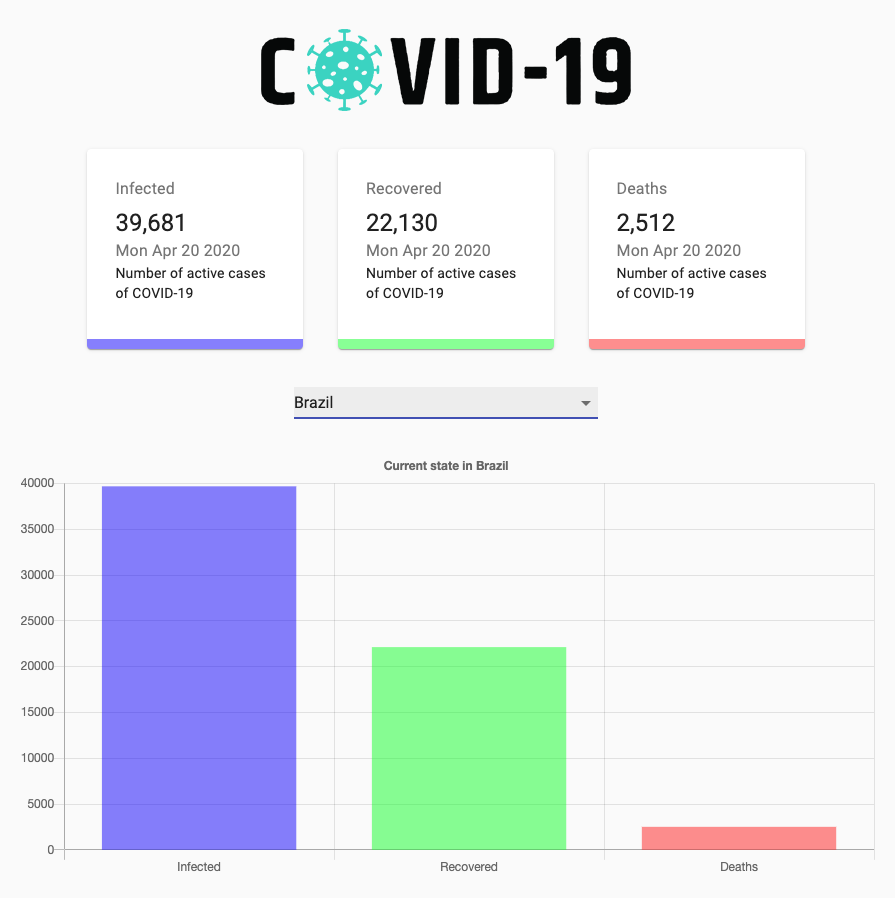

# COVID-19 Tracker with ReactJS (TypeScript, Hooks, MaterialUI, Chartjs, ESLint Standard)

[](https://app.netlify.com/sites/covid19-tracker-ts/deploys)

[https://covid19-tracker-ts.netlify.app](https://covid19-tracker-ts.netlify.app/)



Getting started
```
yarn install
yarn start
```

TODO
- [x] Convert to TypeScript
- [ ] Write the tests
- [ ] Add some routes
- [ ] Add Docker/Docker-compose

Check it out here: [https://covid19-tracker-ts.netlify.app](https://covid19-tracker-ts.netlify.app)

This project is based on [Build a COVID-19 Tracker Application - React JS Project (Hooks, Material UI, Charts js)](https://www.youtube.com/watch?v=khJlrj3Y6Ls), and converted to **TypeScript** just to practice ReactJS and not rust too much. :man_facepalming:
